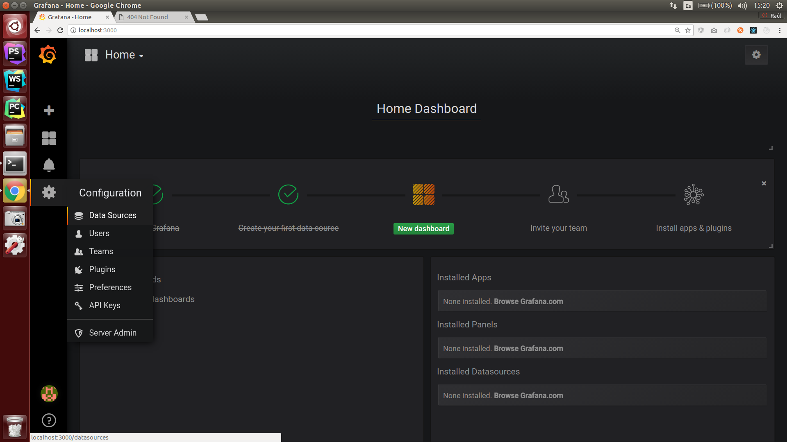
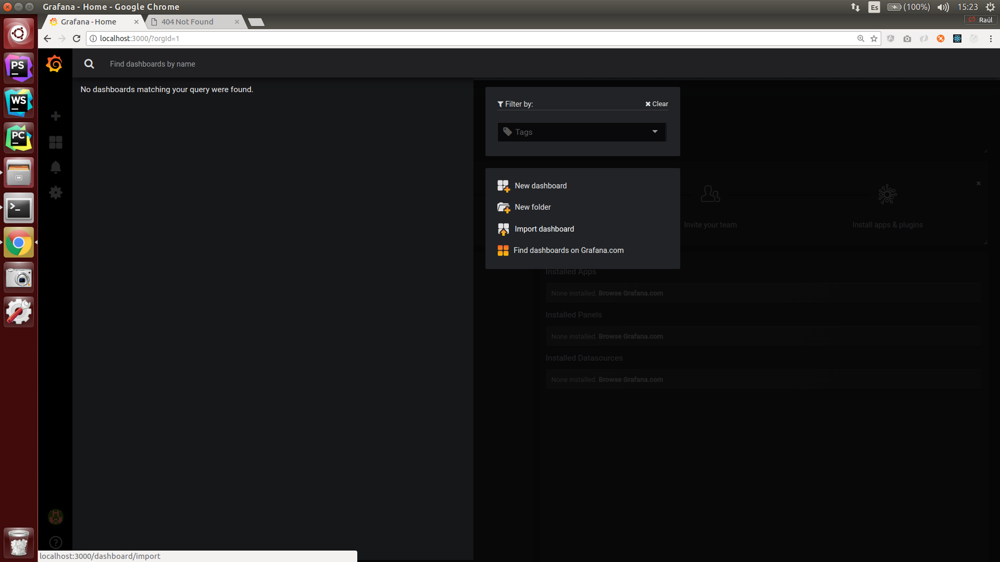

# python-monitoring-talk

This is the files I used for a lightning talk in an event called "PyBirras" (PyBeers) in Tenerife on April 2018.

I talked about the importance of application metrics in a microservice infrastructure and how they have helped my team
to debug and understand much better and faster the behavior of our services (blog post pending).

## Structure
This project has the following parts:

### Docker-compose
A fully working example of a basic stack for testing. This compose contains a grafana container, a prometheus container
and a really simple and useless flask app that will increment some counters every time we hit an endpoint.
### prometheus folder
Here we just define a basic configuration for the Prometheus in order to get metrics from our app.
### app folder
Disclaimer: in a real world application, it is much better to handle all of this metrics logic at a higher level in the request process.
For example, creating our own middleware, so we don't have to repeat code on every endpoint.
### test_app
An app that we can run and tries to simulate random requests with different response status code in order to see some data in our grafana panels.
## How To Use

Requirements: Docker & docker-compose, python2.7 (pending to port the code for python3)

* Run the docker stack `docker-compose up -d --build` This will launch
 all the container in the compose file, and will launch/build our flask server.
* Install the requirements of the test app (I recommend the use of virtualenv/pipenv) `pip install -r requirements.txt`
* Launch the test app to simulate requests `python3 test_app.py`

Go to `http://localhost:5000/` To check that our flask app is working.

Now you can navigate to the Prometheus endpoint at http://localhost:9090 to see your metrics working.
But, this is too ugly, isn't it? Let's do some Grafana!

* Go to http://localhost:3000/login (user: admin, password: admin)
* The first thing we will need is to add a datasource. Click on Datasources at the left menu

Click `Add Datasources` and add our Prometheus configuration

**Please, make sure you use the correct data, specially in Name, Url and Scrape Interval!!**

Make sure you add the "s" of seconds in scrape interval

Click on `Save & Test` , a green alert should appear at the top right corner.

* Now click home ro go to  `http://localhost:3000` again to exit the datasources view
* In the top left corner, click on "Home" and at the right on `Import dashboard`

Click on `Upload .json File` and select the json in this repo `flask_app_example_dashboard.json`

If you had the test app running, you will see how metrics appear in the example graph:

### Now what?
Explore! Have a look at the flask app code, have a look at the prometheus documentation (use gauges, histograms...) And Grafana panel! You can monitorize your containers
set up, you can add different graphs for different data. Possibilities are huge!

Contributions are welcome